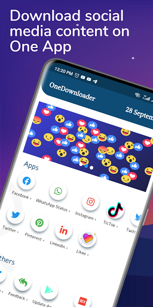

# 🔥🔥 Onedownloader   

## ✨ Requirements
* Any Operating System (ie. MacOS X, Linux, Windows)
* Any IDE with Flutter SDK installed (ie. IntelliJ, Android Studio, VSCode etc)
* Simple knowledge of Dart and Flutter

## 📸 ScreenShots

 |   
 | 

<!-- ABOUT THE PROJECT -->
## About The Project
Download All social media content which includes Whatsapp status saver, Facebook downloader, Instagram downloader, TikTok downloader app and all social media saver and downloader in just one App.

Key Features of OneDownloader App

✔ View and Saved Whatsapp Stories and status even after 24 hours
✔ Swift and User-Friendly Interface
✔ TikTok Downloader
✔ Facebook downloader
✔ Instagram downloader
✔ Likee Downloader
✔ LinkedIn Downloader and others social media
✔  Small memory space
✔ App Provide inbuilt image viewer for image
✔ App Provide inbuilt media player for video
✔ Easily Save and share
✔ Download all social media video, status, image, etc in just one App

How to Use?

Whatsapp Status saver:
-> Watch the story or status in WhatsApp.
-> Open OneDownloader App, Goto Whatapp Page, Click on image or video tab to view all video and image, 
->  Click on image or video to view in full screen.
-> Click the Download to save WhatsApp story image/video.

Facebook:
-> Go to your Facebook page,  click on menu
-> Click on Copy link
-> Open OneDownloader App, Click on the Facebook icon
-> Press Paste Button to paste the link
-> Click on the download Button and preview it to download.

Others:
-> Tap your video or click on menu icon
-> Copy the link and open OneDownloader
-> Click any social media of your choice
->  Tap on Paste button to paste the link
->  Tap on the download button to preview and download

Star⭐ the repo if you like what you see😉.

- [Download APK](https://flutter.dev/docs/get-started/codelab)

## 🤓 Author(s)
**Olajire Abdullah (SilenceCodder)** 

<!-- LICENSE -->
## License

Distributed under the MIT License. See `LICENSE.txt` for more information.

(<a href="#top">back to top</a>)

